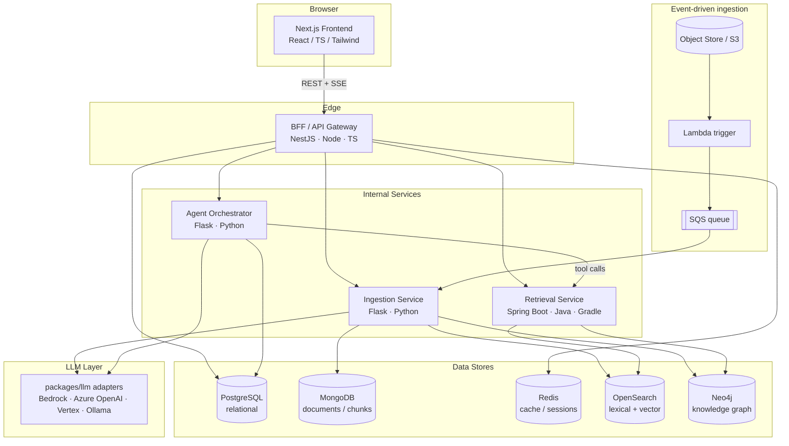
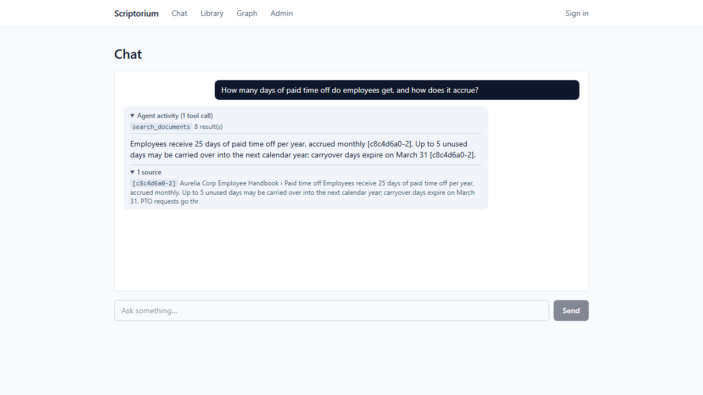
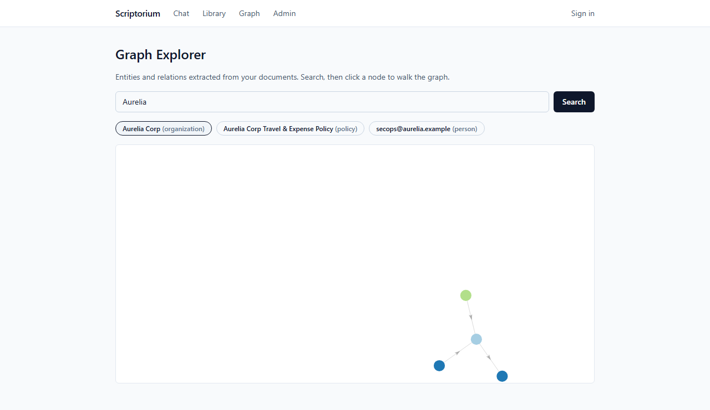
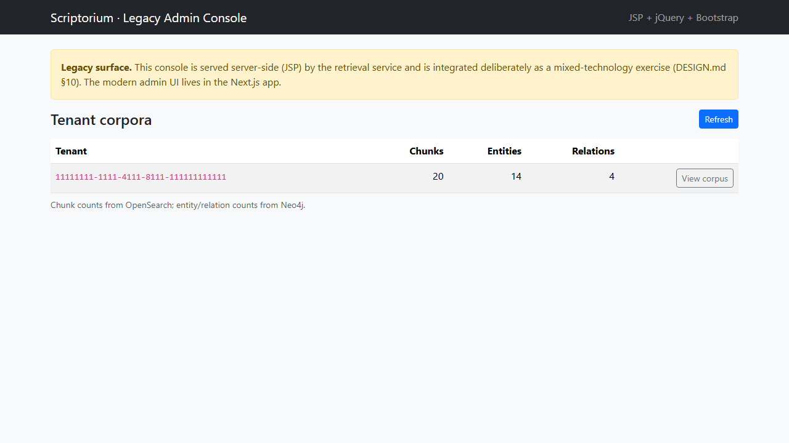

# Scriptorium

Enterprise knowledge intelligence platform: it ingests an organization's
documents, builds a hybrid vector index and a knowledge graph over them, and
answers questions through a tool-using AI agent that returns grounded, cited
answers. Multi-tenant, role-based, fully audited, with guardrails on the
agent and an evaluation harness for retrieval and generation quality.

This is a portfolio project built against a specific full-stack + GenAI role;
the [requirements traceability](#requirements-traceability) tables below map
every line of that role's requirements to a concrete part of the system. The
polyglot breadth (three backend stacks, five datastores) is deliberate
resume-coverage and is discussed honestly in
[ARCHITECTURE.md Appendix B](docs/ARCHITECTURE.md#18-appendix-b--scope-and-honesty-note).

**Authoritative spec:** [docs/ARCHITECTURE.md](docs/ARCHITECTURE.md).
**Milestone status: M0–M7 complete** (Section 15 delivery plan) — with the
environment-bound limitations listed in
[What runs live vs. what is authored](#what-runs-live-vs-what-is-authored--validated),
which is worth reading before you assume anything runs somewhere.

## Architecture

The write path (documents → indexed, graph-linked knowledge) is separated
from the read/reason path (questions → grounded answers): a real
command/query split (ARCHITECTURE.md Section 4).



- **BFF (NestJS)** — the only edge: JWT auth, tenant scoping, rate limits,
  SSE streaming to the browser.
- **Ingestion (Flask)** — parse → chunk → embed → index to OpenSearch,
  extract entities/relations to Neo4j, store documents/chunks in MongoDB.
- **Retrieval (Spring Boot/Gradle)** — hybrid BM25 + kNN with reciprocal
  rank fusion, graph queries, graph-augmented context; also serves the
  **legacy admin console** (JSP + jQuery + Bootstrap, deliberately old-style
  — see below).
- **Agent (Flask)** — bounded tool-use loop with schema-validated,
  tenant-scoped tools, citation validation, refusal on ungrounded answers,
  full run/step tracing to Postgres, token streaming.

## Quickstart (laptop mode — no cloud account)

Prerequisites: Docker Desktop, ~10 GB free disk. Everything runs locally,
including the LLM (Ollama).

```sh
docker compose -f infra/docker/docker-compose.yml up -d --build
# or, with make:  make up
```

First run downloads a ~2.3 GB local model into a volume; later starts are
fast. When all containers are healthy:

| URL | What | Credentials |
|---|---|---|
| http://localhost:3000 | Frontend (chat, library, graph, admin) | `demo@scriptorium.local` / `scriptorium-demo` |
| http://localhost:8080/legacy/admin/ | Legacy admin console (JSP) | `admin` / `scriptorium-dev` (HTTP Basic) |
| http://localhost:3001/health | BFF health | — |

All credentials are dev-only compose defaults; see
`infra/docker/.env.example`. Auth is email/password JWT for the demo — a
production deployment would federate SSO (ARCHITECTURE.md Section 11).

**The ten-minute tour:** sign in → upload a document in **Library** and
watch it reach `indexed` → ask about it in **Chat** and expand the agent's
tool trace and source citations (local CPU inference takes a minute or two —
patience, or plug an API model via `.env`) → search an entity in **Graph**
and click through its neighborhood → open **Admin** and follow the
clearly-labeled link into the legacy JSP console to see corpus and graph
statistics per tenant.

Operational details (resets, logs, model swaps, the eval and e2e runners,
LocalStack/Terraform lifecycle): [docs/runbook.md](docs/runbook.md).

## Screenshots

Captured from the running compose stack by the (env-gated) Playwright
screenshot spec — regenerate with
`SCREENSHOTS=1 npx playwright test tests/screenshots.spec.ts` in `e2e/`.

**Chat — the agent's tool trace, grounded answer, and expandable citation:**



**Graph explorer — an entity neighborhood extracted from the corpus:**



**Legacy admin console — server-rendered JSP, labeled as such:**



Also in [docs/screenshots/](docs/screenshots/): the
[library](docs/screenshots/library.png) with ingestion statuses and the
[modern admin page](docs/screenshots/admin.png) that links the console.

## Requirements traceability

The spine of the project (ARCHITECTURE.md Section 2): every required and preferred
qualification of the target role, mapped to where the codebase demonstrates
it. Rows marked *candidate attribute* are credentials no program can
demonstrate; they are listed for completeness.

### Required qualifications

| # | Requirement | Where demonstrated | How |
|---|---|---|---|
| R1 | Bachelor's in CS or similar technical field | *Candidate attribute.* Whole system demonstrates applied CS: distributed systems, retrieval algorithms, graph modeling, ranking. | Pairs with the candidate's CS degree track. |
| R2 | Full stack, frontend + backend, incl. Angular/React/Next.js and JS/TS/HTML5/CSS3 | `frontend/` | Next.js + React + TypeScript app: streaming chat, document library, knowledge-graph explorer, admin. HTML5 semantics + CSS3 via Tailwind, plus a Bootstrap-based legacy console (see RP5). |
| R3 | Backend in Node.js, Python (Django/Flask), or Java (Spring Boot) | `services/bff` (Node), `services/ingestion` + `services/agent` (Python/Flask), `services/retrieval` (Java/Spring Boot) | All three stacks used deliberately, each with a distinct responsibility (ARCHITECTURE.md Section 7). |
| R4 | Build and consume REST APIs; microservices or serverless in production | All `services/*`; `infra/terraform` | REST across every service with contract tests (Pact) between BFF and retrieval. Four-service microservice topology. Serverless ingestion trigger: S3 upload → Lambda → SQS — **proven end to end on LocalStack** (see status table). |
| R5 | Relational DB + at least 1 NoSQL; Git; Azure DevOps or similar; Docker; Agile/Scrum; automated testing; CI/CD | Data layer + `infra/` + `.github/` + `azure-pipelines.yml` + `docs/backlog.md` | Postgres (relational); MongoDB and Redis (NoSQL). Git with Conventional Commits. CI/CD in GitHub Actions (executed) and an Azure DevOps mirror (authored — see status table). Docker for every service. Agile backlog per milestone. Test pyramid: unit, integration, contract, e2e, AI eval (ARCHITECTURE.md Section 13). |
| R6 | Develop/integrate/deploy AI, GenAI, or agentic AI in enterprise apps on AWS/Azure/GCP | `services/agent`, `services/ingestion`, `packages/llm`, `infra/terraform` | RAG pipeline + bounded agentic tool-use loop with guardrails, tracing, and an eval harness. Provider-agnostic LLM layer (Ollama local, Bedrock, Anthropic API). AWS target authored in Terraform with Bedrock IAM — validated, not applied (see status table). |
| R7 | Ability to travel ~20% | *Candidate attribute.* | — |
| R8 | Limited immigration sponsorship may be available | *Employer term.* | — |

### Preferred qualifications

| # | Requirement | Where demonstrated | How |
|---|---|---|---|
| RP1 | OOP, design patterns, clean coding | Throughout + `docs/adr/` | NestJS and Spring Boot are OOP + DI heavy. Patterns applied intentionally and named in code/ADRs: Adapter/Strategy (LLM providers), Repository, ports-and-adapters (service internals), CQRS-lite (write/read split), Circuit-breaker-style degradation (graph fallback). Lint/format gates and ten ADRs enforce the discipline. |
| RP2 | Secure, reusable, responsive, maintainable apps | Cross-cutting; `packages/` | Controls per `docs/security.md`; shared `packages/llm` and contracts; responsive + accessible UI (axe-core gate in e2e); tests, typed contracts, ADRs. |
| RP3 | Secure dev, DevOps, DevSecOps, web security, GitOps, Kubernetes customization | `.github/`, `infra/k8s`, `infra/gitops` | DevSecOps pipeline: Semgrep (+custom rules), gitleaks, Trivy (fs + images), SBOM (Syft), cosign keyless signing, findings gate; CodeQL SAST live in CI (see status table). Kustomize base + dev/staging/prod overlays; Argo CD manifests + staging tag-bump automation; Kyverno signed-image admission policy. |
| RP4 | OpenSearch, Elasticsearch, Neo4j, Memgraph, Maven, or Gradle | `services/retrieval`, data layer | OpenSearch hybrid (lexical + vector) retrieval; Neo4j knowledge graph with parameterized Cypher; Spring Boot service built with Gradle. |
| RP5 | Bootstrap, jQuery, or JSP in legacy or mixed-technology environments | `services/retrieval/src/main/webapp/` | Server-rendered JSP console (jQuery AJAX + Bootstrap via WebJars) served by the Spring Boot service, linked from the modern admin page and labeled as a legacy tool integrated deliberately (ADR-0009). |
| RP6 | Cloud certification in AWS/Azure/GCP | *Candidate attribute.* | Cloud-native IaC in `infra/terraform` demonstrates the underlying competency. |

If you're asking "show me where you did X," these tables are the answer.

## What runs live vs. what is authored + validated

This section exists so the README stays accurate for someone who checks.
Everything below is real code in this repository; the distinction is where
it has actually executed.

| Area | Status |
|---|---|
| **Local stack** (`docker compose`) | **Runs live.** Eleven containers; every milestone's acceptance was demonstrated against this stack, including the Playwright e2e journeys. |
| **CI (GitHub Actions)** | **Runs live** on every push: per-service lint + tests, contract-drift check, Terraform validate + Checkov. |
| **Security scans: Semgrep, gitleaks, Trivy (fs + image), SBOM, cosign signing** | **Run live in CI and gate the pipeline on findings.** Semgrep (ERROR), gitleaks (any), and Trivy (HIGH/CRITICAL) are at zero and fail the build on regression; images are signed keyless to the Sigstore transparency log. Current alert triage lives in `docs/security-findings.md`. |
| **CodeQL** | **Runs live in CI.** Activated when the repo went public (GHAS is free on public repos; ADR-0007) and analyzes all three languages with buildless extraction (`build-mode: none`) — java-kotlin included, since the nested Gradle project has no root build for autobuild. CodeQL **reports** to GitHub code scanning and does not gate the pipeline; see `docs/security-findings.md` for its alert triage. |
| **Kubernetes (Kustomize base + overlays)** | **Validated against an ephemeral cluster, not running on persistent infra.** All 30 objects were admitted by a real API server (kind); there is no long-lived cluster continuously running the system. |
| **GitOps (Argo CD)** | **Authored, not executing.** Application manifests and the staging image tag-bump automation are in place and validated with `kustomize build`; no persistent cluster exists for Argo CD to reconcile against (ADR-0007). |
| **Azure DevOps pipeline** | **Authored and schema-valid, never executed** — no ADO organization. The executed pipeline of record is GitHub Actions (ADR-0007). |
| **AWS stack (Terraform: VPC, EKS, RDS, OpenSearch, Bedrock IAM)** | **Validated, never applied.** `terraform fmt`/`validate` clean; Checkov 140 passed / 0 failed / 19 justified skips. A live apply is billable (~$450–550/mo) and deferred pending explicit cost approval (ADR-0008). |
| **Serverless ingestion (S3 → Lambda → SQS)** | **Applied and exercised on LocalStack** — a real upload firing the real Lambda enqueuing a real SQS message, at zero cost. Not executed against real AWS (same cost gate). |
| **Playwright e2e** | **Runs live locally** against the compose stack (8/8 passing, including an axe-core accessibility gate). Not run in CI: the stack needs a multi-GB model pull and CPU LLM inference beyond hosted-runner timeouts (ADR-0009). |
| **AI evaluation** | **Runs live locally** (`scripts/run-eval.ps1`); every number in `docs/eval.md` comes from a real run, with the hardware caveat below. |

## Evaluation results

Methodology in ARCHITECTURE.md Section 9.4; full results and caveats in
[docs/eval.md](docs/eval.md). Latest clean run on the 10-query labeled set:

- **Retrieval** (hybrid BM25 + kNN, RRF): **recall@5 = 1.0, MRR = 1.0** —
  on an easy, topically disjoint 4-document set; this proves the pipeline,
  not state-of-the-art retrieval quality.
- **Generation** (agent loop, 5-query subset): citation coverage **0.47**
  and LLM-judged groundedness **0.0** on the final run, against **0.2 /
  0.4** on the previous run — same code, same model. **These are
  3B-model-on-CPU baseline numbers, and the spread is the point**: the small
  model writes correct answers with inconsistent inline citations, and the
  same-size self-judge is noisy enough to mark verifiably correct, fully
  cited answers ungrounded (`docs/eval.md` records both runs and the
  judge-noise analysis). The generator and judge are env-swappable
  (`CHAT_MODEL`, Bedrock/Anthropic adapters); track the trend, not the
  absolute value.

## Security

Threat model and control list in [docs/security.md](docs/security.md);
finding-by-finding triage ledger in
[docs/security-findings.md](docs/security-findings.md) (33 HIGH/CRITICAL +
8 SAST findings driven to zero, no blanket waivers). Application controls
include parameterized queries everywhere (SQL, Cypher, OpenSearch DSL),
server-side tenant scoping, security headers (nosniff + frame protection on
both origins, HSTS on the BFF; CSP is `frame-ancestors` only — no
`script-src` policy), per-IP rate limits (tighter on login), and the
GenAI-specific set: prompt-injection handling, tool allowlisting, citation
validation, refusal on empty retrieval, PII filter hook.

## Testing

| Level | Tooling | Where |
|---|---|---|
| Unit | Jest, pytest, JUnit 5, vitest | per service |
| Contract | Pact (BFF ↔ retrieval), drift-checked in CI | `packages/contracts/pacts` |
| End-to-end | Playwright + axe-core against the compose stack | `e2e/` (`npm test`) |
| AI eval | Custom harness, `POST /eval/run` | `services/agent/eval`, `scripts/run-eval.ps1` |

## Repository layout

| Path | What |
|---|---|
| `frontend/` | Next.js + React + TS app (chat, library, graph, admin) |
| `services/bff` | NestJS edge API (auth, tenant scope, SSE) |
| `services/ingestion` | Flask write path (parse → chunk → embed → index → graph) |
| `services/agent` | Flask reason path (tool-using agent loop, eval harness) |
| `services/retrieval` | Spring Boot read path (hybrid search, graph, legacy JSP console) |
| `packages/` | LLM provider adapters, API contracts/pacts |
| `e2e/` | Playwright journeys + accessibility gate |
| `infra/docker` | Local compose stack |
| `infra/terraform` | AWS stack + LocalStack serverless root |
| `infra/k8s`, `infra/gitops` | Kustomize base/overlays, Kyverno policy, Argo CD apps |
| `docs/` | ARCHITECTURE.md, ADRs 0001–0009, backlog, eval, security, runbook |
