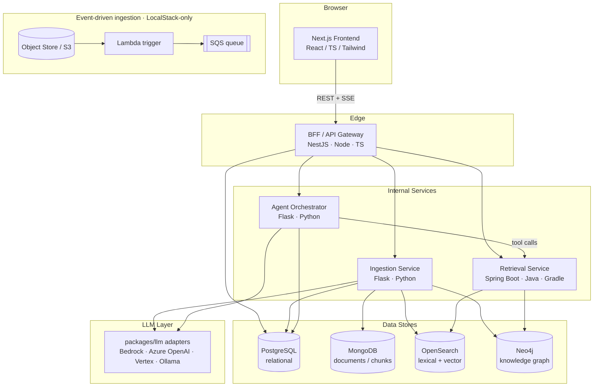
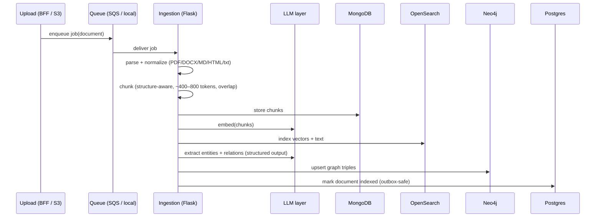
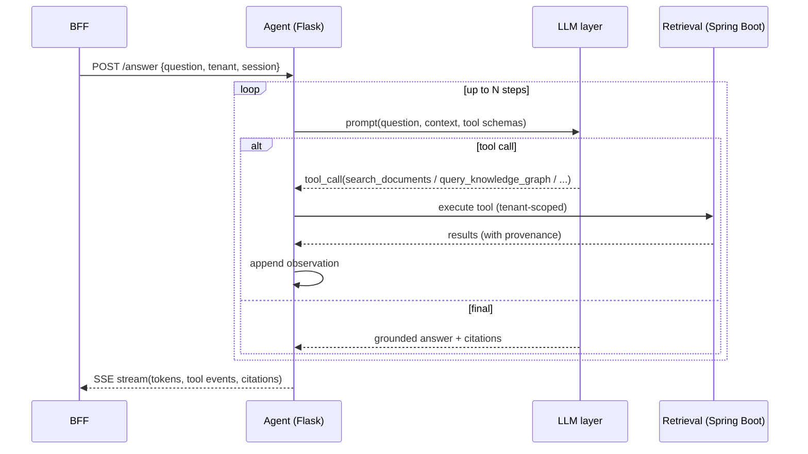
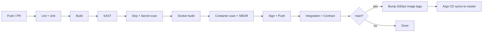

# Scriptorium — Enterprise Knowledge Intelligence Platform
### Engineering Design Document

| | |
|---|---|
| **Version** | 1.0 |
| **Author** | Mason |
| **Status** | Living document |
| **Repository** | monorepo, `scriptorium/` |

---

## 0. How to read this document

This is both the system's design document and its delivery plan. Sections 1–14 describe what the system is and why it is built this way. Section 15 is the phased roadmap: each milestone is a shippable increment with its own acceptance criteria, built strictly one milestone at a time.

Where this document left a downstream decision unspecified, the choice most consistent with the stated design goals (Section 3) was taken and recorded as an ADR (Section 17) rather than scope being invented silently. The test and security gates in Sections 13 and 16 are treated as binding.

Section 18 is a candid framing note worth reading: some of this system's breadth is deliberate resume signal rather than what a lean production system would choose, and being able to say so is part of the point.

---

## 1. Purpose & context

Scriptorium is a multi-tenant platform that ingests an organization's documents, builds both a searchable vector index and a knowledge graph over them, and answers questions through a tool-using AI agent that returns grounded, cited answers. It is built to enterprise expectations: tenant isolation, role-based access control, full audit of every AI interaction, guardrails on the agent, and an evaluation harness for retrieval and generation quality.

The name follows the medieval scriptorium, the room where manuscripts were read, copied, indexed, and transmitted. The system is a modern one: it reads a corpus, indexes it, and transmits synthesized knowledge on request.

This project exists as a portfolio piece targeting a full-stack plus GenAI engineering role. Section 2 maps every line of that role's requirements to a concrete part of the system, so that a reviewer cloning the repository can trace competency directly. The domain was chosen because enterprise RAG and agentic assistants are the actual deliverable that consulting-style GenAI teams ship, so the project reads as job-relevant work rather than a tech demo.

---

## 2. Requirements traceability matrix

This is the spine of the project. Every required and preferred qualification maps to a location in the codebase. Rows marked *candidate attribute* are credentials or availability facts that no program can demonstrate; they are listed for completeness and paired with the part of the system that demonstrates the underlying competency.

### 2.1 Required qualifications

| # | Requirement | Where demonstrated | How |
|---|---|---|---|
| R1 | Bachelor's in CS or similar technical field | *Candidate attribute.* Whole system demonstrates applied CS: distributed systems, retrieval algorithms, graph modeling, ranking. | Pairs with the candidate's CS degree track. |
| R2 | Full stack, frontend + backend, incl. Angular/React/Next.js and JS/TS/HTML5/CSS3 | `frontend/` | Next.js + React + TypeScript app: streaming chat, document library, knowledge-graph explorer, admin and analytics dashboards. HTML5 semantics + CSS3 via Tailwind, plus a Bootstrap-based legacy console (see R-P5). |
| R3 | Backend in Node.js, Python (Django/Flask), or Java (Spring Boot) | `services/bff` (Node), `services/ingestion` + `services/agent` (Python/Flask), `services/retrieval` (Java/Spring Boot) | All three stacks used deliberately, each with a distinct responsibility. See Section 7. |
| R4 | Build and consume REST APIs; microservices or serverless in production | All `services/*`; `infra/terraform` serverless stack | REST across every service with OpenAPI contracts (`packages/contracts`). Four-service microservice topology. Serverless ingestion trigger: S3 upload → Lambda → SQS (trigger proven on LocalStack; no SQS consumer implemented yet — see §8.3 and the README status table). Production-grade via containerization + Kubernetes. |
| R5 | Relational DB + at least 1 NoSQL; Git; Azure DevOps or similar; Docker; Agile/Scrum; automated testing; CI/CD | Data layer + `infra/` + `.github/` + `azure-pipelines.yml` + `docs/backlog.md` | Postgres (relational); MongoDB (NoSQL — Redis is provisioned but not yet connected, see §8.3). Git with Conventional Commits. CI/CD in both GitHub Actions and an Azure DevOps pipeline. Docker for every service. Agile backlog and sprint plan (Section 15, `docs/backlog.md`). Full test pyramid (Section 13). |
| R6 | Develop/integrate/deploy AI, GenAI, or agentic AI in enterprise apps on AWS/Azure/GCP | `services/agent`, `services/ingestion`, `packages/llm`, `infra/terraform` | RAG pipeline + agentic orchestration loop. Provider-agnostic LLM layer with adapters for AWS Bedrock, Azure OpenAI, and Google Vertex. Enterprise concerns: tenant isolation, RBAC, audit, guardrails, eval harness. Deployed to AWS as primary target via Terraform. |
| R7 | Ability to travel ~20% | *Candidate attribute.* Not applicable to the build. | — |
| R8 | Limited immigration sponsorship may be available | *Employer term.* Not applicable to the build. | — |

### 2.2 Preferred qualifications

| # | Requirement | Where demonstrated | How |
|---|---|---|---|
| RP1 | OOP, design patterns, clean coding | Throughout + `docs/adr/` | NestJS and Spring Boot are OOP + dependency-injection heavy. Named patterns applied intentionally: Adapter/Strategy (LLM providers), Repository (data access), Hexagonal/ports-and-adapters (service internals), CQRS-lite (write vs read path split), Circuit Breaker (inter-service resilience), Transactional Outbox (async ingestion), Factory (tool construction). Linting, formatting, and ADRs enforce clean-code discipline. |
| RP2 | Secure, reusable, responsive, maintainable apps | Cross-cutting; `packages/` | Security controls per Section 12. Reuse via shared packages (`packages/llm`, `packages/contracts`, `packages/ui`). Responsive Tailwind UI. Maintainability via tests, ADRs, typed contracts, modular services. |
| RP3 | Secure dev, DevOps, DevSecOps, web security, GitOps, Kubernetes customization | `.github/`, `infra/k8s`, `infra/gitops` | DevSecOps pipeline: SAST (Semgrep + CodeQL), dependency scanning (Trivy + Dependabot), secret scanning (gitleaks), container scanning (Trivy), SBOM (Syft), image signing (cosign). OWASP controls in code. GitOps via Argo CD. Kubernetes customization via Kustomize base + per-environment overlays. |
| RP4 | OpenSearch, Elasticsearch, Neo4j, Memgraph, Maven, or Gradle | `services/retrieval`, data layer | OpenSearch for hybrid (lexical + vector) retrieval. Neo4j for the knowledge graph. Spring Boot service built with Gradle. |
| RP5 | Bootstrap, jQuery, or JSP in legacy or mixed-technology environments | `services/retrieval/legacy-admin` | A server-rendered legacy admin console (JSP + jQuery + Bootstrap) served by the Spring Boot service, framed as a pre-existing legacy tool integrated into the modern platform. Deliberately illustrates mixed-tech integration. |
| RP6 | Cloud certification in AWS/Azure/GCP | *Candidate attribute.* Cloud-native IaC in `infra/terraform` demonstrates the competency. | Pairs with a parallel cloud certification track. |

If a reviewer asks "show me where you did X," this table is the answer.

---

## 3. Design goals and non-goals

### 3.1 Goals

The system should be runnable end to end on a laptop with a single command, so that a reviewer can clone and see it work without a cloud account. It should also be deployable to a real cloud through infrastructure as code, so that the production story is demonstrable rather than hypothetical. Every component should be independently testable, and the whole should meet enterprise expectations around isolation, access control, auditability, and safety of the AI layer. The codebase should read as intentional: patterns chosen for reasons, decisions recorded, tests meaningful rather than coverage theater.

### 3.2 Non-goals

Scriptorium is not trying to be a production SaaS with billing, SSO federation, or horizontal auto-scaling tuning. It is not trying to beat a hosted RAG product on retrieval quality. It does not need to support every document format on earth; PDF, DOCX, Markdown, HTML, and plain text are sufficient. It is not a real-time collaborative editor. Keep scope inside these lines unless a milestone explicitly expands them.

---

## 4. System overview

Scriptorium separates the **write path** (turning documents into indexed, graph-linked knowledge) from the **read/reason path** (answering questions over that knowledge). This split is a real command/query separation and gives each concern a clean home.

- The **frontend** (Next.js) is the only thing users touch.
- The **BFF** (NestJS) is the single edge API: it authenticates requests, enforces tenant scope, orchestrates calls to internal services, and streams agent output to the browser.
- The **ingestion service** (Flask) is the write path: chunk, embed, index to OpenSearch, extract entities and relations to Neo4j, store raw documents and chunks in MongoDB.
- The **retrieval service** (Spring Boot) is the read path: hybrid search over OpenSearch, graph queries over Neo4j, reranking, and returning assembled context. It also hosts the legacy admin console.
- The **agent service** (Flask) is the reason path: a tool-using agent loop that calls retrieval and graph tools, synthesizes a grounded answer via the LLM layer, applies guardrails, and streams tokens back.
- **Postgres** holds all relational state (tenants, users, roles, document registry, chat sessions and messages, agent run traces). **OpenSearch** and **Neo4j** back retrieval. (Redis is provisioned in the stack but not yet connected — see §8.3.)

### 4.1 Container diagram



---

## 5. Technology stack

Versions are the intended baseline; patch versions may be bumped when a security scan requires it, and any major-version deviation is recorded as an ADR.

| Layer | Choice | Version target | Rationale (tie to JD where relevant) |
|---|---|---|---|
| Frontend framework | Next.js (App Router) + React | Next 15.x, React 19.x | Satisfies R2 (Next.js/React). SSR/streaming for agent tokens. |
| Language, frontend | TypeScript | 5.x | R2. |
| Styling | Tailwind CSS 4 (primary) + Bootstrap 5 (legacy console) | — | HTML5/CSS3 (R2); Bootstrap (RP5). |
| Graph viz | Cytoscape.js or react-force-graph | latest | Renders the Neo4j knowledge graph. |
| Edge API | NestJS on Node.js | Nest 11.x, Node 22 LTS | R3 (Node). DI + modules = OOP/patterns (RP1). |
| Ingestion + Agent | Flask on Python | Flask 3.x, Python 3.12 | R3 (Python/Flask). |
| Retrieval | Spring Boot (Java) built with Gradle | Boot 3.4.x, Java 21, Gradle 8.x | R3 (Spring Boot); Gradle (RP4). Hosts JSP legacy console (RP5). |
| Relational DB | PostgreSQL | 16 | R5 relational. |
| Document store | MongoDB | 7 | R5 NoSQL. |
| Cache / sessions (provisioned) | Redis | 7 | Provisioned, not yet wired — see §8.3. MongoDB alone carries R5's NoSQL requirement. |
| Search + vectors | OpenSearch | 2.15+ | RP4; RAG retrieval (R6). |
| Knowledge graph | Neo4j | 5.x | RP4; graph-augmented retrieval. |
| LLM providers | AWS Bedrock, Azure OpenAI, Google Vertex, Ollama (local) | — | R6 multi-cloud; local mode for laptop demos. |
| Containers | Docker + docker-compose | — | R5. |
| Orchestration | Kubernetes via Kustomize | — | RP3 (K8s customization). |
| GitOps | Argo CD | — | RP3. |
| IaC | Terraform | 1.9+ | RP6; R4 serverless; R6 cloud deploy. |
| CI/CD | GitHub Actions + Azure DevOps pipeline | — | R5 (CI/CD + "Azure DevOps or similar"). |
| Contract types | OpenAPI 3.1 | — | R4; shared types generation. |

---

## 6. Repository structure

A monorepo. It keeps the whole system reviewable in one clone and keeps changes that cross service boundaries coherent. Plain directory layout; adopt Nx or Turborepo only if a milestone justifies it.

```
scriptorium/
├── README.md
├── docs/
│   ├── ARCHITECTURE.md                  # this document (source of truth)
│   ├── backlog.md                 # epics + user stories (Agile artifact)
│   ├── security.md                # threat model + control list
│   ├── eval.md                    # AI evaluation methodology + results
│   ├── runbook.md                 # local + cloud operations
│   └── adr/
│       ├── 0000-template.md
│       └── 0001-record-architecture-decisions.md
├── frontend/                      # Next.js + React + TS
├── services/
│   ├── bff/                       # NestJS (Node/TS)
│   ├── ingestion/                 # Flask (Python)
│   ├── agent/                     # Flask (Python)
│   └── retrieval/                 # Spring Boot (Java/Gradle)
│       └── src/main/webapp/       # JSP + jQuery + Bootstrap legacy console
├── packages/
│   ├── llm/                       # Python: LLM provider adapters (shared)
│   ├── contracts/                 # OpenAPI specs + generated TS/py types
│   └── ui/                        # shared React components (optional)
├── infra/
│   ├── docker/                    # Dockerfiles + docker-compose.yml (local)
│   ├── terraform/                 # AWS: VPC, EKS, RDS, OpenSearch, S3, Lambda, SQS, IAM, Bedrock
│   ├── k8s/
│   │   ├── base/                  # Kustomize base
│   │   └── overlays/{dev,staging,prod}/
│   └── gitops/                    # Argo CD Application manifests
├── .github/workflows/             # CI/CD (GitHub Actions)
├── azure-pipelines.yml            # CI/CD (Azure DevOps)
├── .semgrep.yml
├── .gitleaks.toml
└── Makefile                       # top-level dev commands
```

---

## 7. Service-by-service design

Each service follows ports-and-adapters internally: a domain core with no framework imports, surrounded by adapters for HTTP, persistence, and external clients. This keeps the domain testable and is a concrete demonstration of clean architecture (RP1, RP2).

### 7.1 BFF / API Gateway — NestJS (Node/TS)

**Responsibility.** The only public API. Authenticates requests (JWT), resolves tenant context, enforces coarse authorization, orchestrates internal service calls, aggregates responses, and streams agent output to the browser over Server-Sent Events. Owns nothing domain-heavy; it is the composition and edge-security layer.

**Why Node/NestJS here.** SSE streaming and request fan-out are natural in Node's async model, and NestJS's module/provider/DI structure demonstrates OOP and design patterns cleanly (RP1). It is also the layer a frontend engineer touches most, reinforcing the full-stack story.

**Representative endpoints** (OpenAPI is the source of truth in `packages/contracts`):

| Method | Path | Purpose |
|---|---|---|
| POST | `/api/v1/auth/login` | Issue JWT (email/password for the demo). |
| GET | `/api/v1/documents` | List documents in tenant (paginated). |
| POST | `/api/v1/documents` | Upload a document (multipart), enqueue ingestion. |
| GET | `/api/v1/documents/{id}/status` | Ingestion status. |
| POST | `/api/v1/chat/sessions` | Create a chat session. |
| POST | `/api/v1/chat/sessions/{id}/messages` | Ask a question; response streams via SSE. |
| GET | `/api/v1/graph/search?q=` | Proxy to retrieval graph query. |
| GET | `/api/v1/admin/audit` | Query audit log (admin role). |

**Internal design.** Modules per bounded context (`auth`, `documents`, `chat`, `graph`, `admin`). A `TenantContext` request-scoped provider carries tenant id derived from the JWT. Downstream calls go through a resilient HTTP client with a Circuit Breaker (RP1) so a failing internal service degrades gracefully.

### 7.2 Ingestion Service — Flask (Python)

**Responsibility.** The write path. Consumes ingestion jobs (from the SQS-backed queue in cloud mode, or a local in-process/Redis queue in laptop mode) and runs the pipeline in Section 9.1: parse, chunk, embed, index to OpenSearch, extract graph triples to Neo4j, persist raw content and chunks to MongoDB, update the document registry in Postgres.

**Why Python/Flask here.** The parsing, chunking, and embedding ecosystem lives in Python. Flask keeps the service lean and satisfies R3's Flask option. Uses the shared `packages/llm` for embeddings and extraction.

**Reliability.** Uses a Transactional Outbox pattern (RP1) so that "document registered in Postgres" and "job enqueued" cannot diverge. Ingestion is idempotent per document version so retries are safe.

**Representative endpoints.**

| Method | Path | Purpose |
|---|---|---|
| POST | `/ingest` | Accept a job (internal, called by BFF or queue consumer). |
| GET | `/health`, `/ready` | Liveness / readiness. |
| GET | `/metrics` | Prometheus metrics. |

### 7.3 Retrieval Service — Spring Boot (Java, Gradle)

**Responsibility.** The read path. Given a query and tenant scope, run hybrid retrieval (BM25 + kNN vector search) over OpenSearch, run targeted graph queries over Neo4j (entity neighborhoods, path queries), fuse and rerank results, and return an assembled, deduplicated context set with provenance. Also serves the **legacy admin console** (JSP + jQuery + Bootstrap) for corpus and tenant administration.

**Why Java/Spring Boot here.** Enterprises frequently place search aggregation and heavy read services on the JVM; Spring Boot's layered architecture and DI demonstrate OOP at production scale (RP1), Gradle satisfies RP4, and hosting server-rendered JSP satisfies RP5 in a way that is honestly a legacy pattern rather than a contrived one.

**Representative endpoints.**

| Method | Path | Purpose |
|---|---|---|
| POST | `/retrieve` | Hybrid retrieve; returns ranked chunks + provenance. |
| GET | `/graph/entity/{id}/neighborhood` | Entity neighborhood from Neo4j. |
| GET | `/graph/search?q=` | Entity/relation search. |
| GET | `/legacy/admin/**` | Server-rendered JSP console (RP5). |

**Retrieval fusion.** Reciprocal Rank Fusion over the lexical and vector result lists, then an optional cross-encoder or LLM reranker (behind a flag to keep local mode cheap). Graph results contribute entity-linked context that pure vector search misses, which is the justification for the graph existing at all.

### 7.4 Agent Orchestrator — Flask (Python)

**Responsibility.** The reason path and the centerpiece of R6. Runs a tool-using agent loop (Section 9.2): interpret the question, call tools (retrieval, graph, and a small set of utilities), decide whether it has enough grounded context, and synthesize a cited answer via the LLM layer with token streaming. Applies guardrails, records a full trace of every step to Postgres, and exposes hooks for the eval harness.

**Why a separate service.** Isolating the agent keeps its long-running, tool-calling, LLM-bound behavior off the edge API and gives it independent scaling and its own guardrail surface. It shares `packages/llm` with ingestion.

**Representative endpoints.**

| Method | Path | Purpose |
|---|---|---|
| POST | `/answer` | Run the agent for a question; streams SSE tokens + tool events. |
| POST | `/eval/run` | Execute the eval suite against a fixed dataset (internal). |
| GET | `/health`, `/ready`, `/metrics` | Ops. |

---

## 8. Data architecture

Each store earns its place; none is decorative. The pairing of relational, document, key-value, search, and graph stores is broad by design (see Section 18), but each holds data genuinely suited to its model.

### 8.1 PostgreSQL — system of record

Relational, transactional, the source of truth for identity and audit. Managed with a migration tool (Flyway for the JVM service's schema, or a single migration owner such as Alembic driven from ingestion; pick one owner and record it in an ADR).

Core tables (illustrative, extend as needed):

```
tenants(id, name, created_at)
users(id, tenant_id, email, password_hash, created_at)
roles(id, name)                          -- owner, admin, member, viewer
user_roles(user_id, role_id, tenant_id)
documents(id, tenant_id, title, source_uri, mime_type, version,
          status, checksum, created_at, indexed_at)
chat_sessions(id, tenant_id, user_id, title, created_at)
chat_messages(id, session_id, role, content, created_at)   -- role: user|assistant|tool
agent_runs(id, message_id, tenant_id, status, total_tokens,
           latency_ms, created_at)
agent_steps(id, run_id, step_index, kind, tool_name,
            input_json, output_json, tokens, created_at)    -- kind: think|tool|final
audit_log(id, tenant_id, actor_user_id, action, target_type,
          target_id, metadata_json, created_at)
```

Every row is tenant-scoped; queries must filter by `tenant_id`. This is the enforcement point for multi-tenant isolation (R6).

### 8.2 MongoDB — document and chunk store

Schema-flexible payloads that do not belong in a relational schema: the raw extracted text, per-chunk content, and arbitrary source metadata that varies by document type.

```jsonc
// collection: chunks
{
  "_id": "chunk_...",
  "tenant_id": "...",
  "document_id": "...",
  "version": 3,
  "ordinal": 12,
  "text": "…chunk text…",
  "token_count": 412,
  "headings": ["Section 2", "2.1 Overview"],
  "embedding_id": "os_vec_...",   // pointer into OpenSearch
  "metadata": { "page": 5, "source": "handbook.pdf" }
}
```

### 8.3 Redis — provisioned, not yet connected

Redis runs in the compose stack and the Kubernetes manifests, but no service currently constructs a client. There is no cache or session code (authentication is stateless JWT in an HttpOnly cookie), and rate limiting is in-memory in the BFF (`@nestjs/throttler`), not Redis. Redis is kept as provisioned infrastructure for a future use — the natural one being shared rate-limit storage so per-IP limits hold across BFF replicas. Until it is wired, it does not satisfy the "at least one NoSQL" requirement; MongoDB (§8.2) does.

### 8.4 OpenSearch — hybrid retrieval

One index per tenant (or a shared index with a tenant filter; prefer per-tenant for clean isolation). Mapping carries both a full-text field and a dense vector field:

```jsonc
{
  "mappings": {
    "properties": {
      "tenant_id":   { "type": "keyword" },
      "document_id": { "type": "keyword" },
      "chunk_id":    { "type": "keyword" },
      "text":        { "type": "text" },
      "embedding":   { "type": "knn_vector", "dimension": 1024,
                       "method": { "engine": "lucene", "name": "hnsw",
                                   "space_type": "cosinesimil" } }
    }
  }
}
```

Retrieval runs BM25 on `text` and kNN on `embedding`, then fuses (Section 7.3).

### 8.5 Neo4j — knowledge graph

Entities and relations extracted from the corpus during ingestion, enabling graph-augmented answers ("who owns this policy," "what depends on this system"). Property-graph model, tenant-scoped:

```
(:Entity {id, tenant_id, name, type})
(:Document {id, tenant_id, title})
(:Chunk {id, tenant_id, ordinal})

(:Chunk)-[:MENTIONS]->(:Entity)
(:Document)-[:HAS_CHUNK]->(:Chunk)
(:Entity)-[:RELATED_TO {relation, confidence}]->(:Entity)
```

The agent's `query_knowledge_graph` tool runs parameterized Cypher against this model. All Cypher is parameterized and tenant-filtered; no string-built queries (web security, RP3).

---

## 9. The AI / agentic subsystem

This is where R6 is won, so it gets real specification.

### 9.1 Ingestion (RAG write path)



Chunking is structure-aware (respects headings and paragraphs, not naive fixed windows). Entity/relation extraction uses the LLM in structured-output mode with a strict schema and confidence scores; low-confidence triples are dropped or flagged.

### 9.2 The agent loop (reason path)

Pattern: a bounded ReAct-style tool-use loop with an explicit step budget. On each iteration the model may call a tool or emit a final answer; the loop enforces guardrails and records every step.



**Tool set** (each is a typed, allowlisted function; the model never executes arbitrary code):

| Tool | Input | Effect |
|---|---|---|
| `search_documents` | `query: string, k: int` | Hybrid retrieval via Retrieval service. |
| `query_knowledge_graph` | `entity: string` or `cypher_template + params` | Parameterized graph query. |
| `get_document` | `document_id, chunk_range?` | Fetch specific content. |
| `list_recent` | `limit` | Recent documents in tenant. |

Example schema (`search_documents`):

```json
{
  "name": "search_documents",
  "description": "Retrieve the most relevant document chunks for a query within the current tenant.",
  "input_schema": {
    "type": "object",
    "properties": {
      "query": { "type": "string" },
      "k": { "type": "integer", "minimum": 1, "maximum": 20, "default": 8 }
    },
    "required": ["query"]
  }
}
```

**Answer contract.** The final answer must cite the chunks it used by `chunk_id`; the frontend renders citations as links back to source passages. If retrieval returns nothing above a relevance floor, the agent must say it cannot find grounded support rather than answer from parametric memory. This is both a quality and a safety requirement.

**Guardrails.**
- Hard step budget and wall-clock timeout per run.
- Tool allowlist; inputs validated against schema before execution.
- Tenant scope injected server-side into every tool call; the model cannot widen it.
- Prompt-injection mitigation: a system-prompt instruction directs the model to treat tool results as data and ignore any instructions embedded in them (`services/agent/.../loop.py`); tools never take free-form executable input; graph queries are parameterized templates only. This is a prompt-level mitigation, not structural delimiting of untrusted content.
- Output validation: citations must resolve to real chunks in the tenant; unresolved citations are stripped and flagged.
- PII and content policy hook (pluggable filter) on both ingestion and answer paths.

### 9.3 LLM provider abstraction

`packages/llm` defines a provider interface and adapters, an Adapter/Strategy demonstration (RP1) and the mechanism satisfying "AWS, Azure, or GCP" (R6):

```python
class LLMProvider(Protocol):
    def embed(self, texts: list[str]) -> list[list[float]]: ...
    def chat(self, messages, tools=None, stream=False): ...

# Adapters:
#   BedrockProvider      -> AWS Bedrock
#   AzureOpenAIProvider  -> Azure OpenAI
#   VertexProvider       -> Google Vertex
#   OllamaProvider       -> local models for laptop mode
```

Provider is selected by config. Local mode defaults to Ollama so the whole system runs with no cloud account and no API cost. Cloud deployments default to Bedrock (primary target).

### 9.4 Evaluation harness (`docs/eval.md`, `/eval/run`)

Including evaluation is what separates "called an LLM" from "engineered a GenAI system," and it is a strong interview asset.

- **Retrieval metrics** on a fixed labeled set: recall@k and mean reciprocal rank.
- **Generation metrics**: citation coverage (fraction of claims backed by a retrieved chunk) and groundedness/faithfulness via an LLM-as-judge rubric, plus a small human-checked subset.
- Results are written to `docs/eval.md` and regenerated by `/eval/run` so the number is reproducible, not asserted.

### 9.5 AI observability

Every run and step is persisted (`agent_runs`, `agent_steps`) with token counts and latency. OpenTelemetry traces span BFF → agent → retrieval. This is the governance/observability story enterprises require when deploying GenAI (R6).

---

## 10. Frontend design

Next.js App Router, React, TypeScript, Tailwind. Responsive and accessible (semantic HTML5, keyboard navigation, ARIA on interactive elements).

**Pages.**
- **Chat** — streaming assistant with inline citations that expand to source passages; tool-call activity shown as a collapsible trace so the agent's reasoning is legible.
- **Library** — document list, upload, per-document ingestion status.
- **Graph Explorer** — interactive visualization of the Neo4j knowledge graph (Cytoscape.js), click an entity to see its neighborhood.
- **Dashboards** — ingestion throughput, token usage, latency, eval scores.
- **Admin** — tenant, user, and role management.

**State.** Server components for data fetching; a light client store (Zustand or React Query) for chat/session state and SSE handling.

**Legacy console (RP5).** A separate, deliberately old-style admin surface served by the Spring Boot service using JSP + jQuery + Bootstrap, linked from the modern Admin page and clearly labeled as a legacy tool being integrated. This is honest mixed-technology integration, and the labeling is intentional so a reviewer understands the choice.

---

## 11. Cross-cutting: identity, tenancy, config

**AuthN.** JWT issued by the BFF (email/password for the demo; note in the README that production would federate SSO). Short-lived access tokens; tenant id and roles as claims.

**AuthZ.** RBAC with roles owner/admin/member/viewer, sourced from Postgres and carried as JWT claims. The BFF enforces one coarse role gate today — a viewer cannot upload documents (`RolesGuard`, proven by e2e); no service performs fine-grained per-role checks. Every data query is tenant-filtered; tenant scope is derived server-side from the token and never trusted from the client (ADR-0010).

**Config.** Twelve-factor: all config via environment, no secrets in code, `.env.example` documents every variable. Secrets from the cloud secret manager in deployed mode; gitleaks guards against accidental commits (RP3).

**Resilience.** Request timeouts on inter-service calls (e.g. the BFF agent client's `AbortSignal.timeout`), idempotent ingestion, and graceful degradation (if the graph is down, the retrieval service falls back to vector-only and reports the reduced mode). No circuit breaker is implemented; a per-call timeout plus the hybrid-only fallback covers the one dependency that can be degraded.

---

## 12. Security (`docs/security.md`)

A lightweight threat model plus a concrete control list. This section plus the pipeline in Section 16 constitute the DevSecOps story (RP3).

**Application controls (web security, RP3).**
- Input validation at every boundary (DTO validation in Nest, schema validation in Flask, bean validation in Spring).
- Parameterized queries only, across SQL, Cypher, and OpenSearch DSL. No string-built queries.
- AuthZ enforced server-side; no trust in client-supplied tenant or role.
- Security headers on both origins: `X-Content-Type-Options: nosniff` and frame protection (`X-Frame-Options` / CSP `frame-ancestors`) on the BFF (helmet) and the Next.js app; HSTS on the BFF (only meaningful over HTTPS). The CSP is `frame-ancestors` only — there is no `script-src` policy on either origin, because a strict script CSP on the Next App Router requires a per-request nonce that would force dynamic rendering.
- Rate limiting and request size limits at the BFF. Rate-limit buckets are in-memory per instance (`@nestjs/throttler`) — exact at the single-replica stack the quickstart runs; holding per-IP across the 2–3 replica staging/prod overlays would need shared (Redis) storage.
- Secrets are kept out of logs by practice (no secret values are logged in the current code). Structured field-level log scrubbing is aspirational — not yet implemented.
- The GenAI-specific controls in Section 9.2 (prompt-injection handling, tool allowlisting, output validation).

**Supply chain and pipeline controls (DevSecOps, GitOps, RP3).**
- SAST: Semgrep (custom + community rules) and GitHub CodeQL.
- Dependency scanning: Trivy plus Dependabot.
- Secret scanning: gitleaks in CI and as a pre-commit hook.
- Container scanning: Trivy against every built image.
- SBOM: Syft-generated SBOM per image, published as a build artifact.
- Image signing: cosign; deploys admit only signed images (supply-chain integrity, feeds the GitOps story).

A findings gate fails the pipeline on high-severity issues.

---

## 13. Testing strategy

A real pyramid, not coverage theater. Meaningful assertions over line count, though a coverage floor is enforced.

| Level | Scope | Tooling |
|---|---|---|
| Unit | Domain logic per service | Jest (Nest), pytest (Flask), JUnit 5 (Spring) |
| Integration | Service + its real dependencies | Testcontainers (Postgres, Mongo, Redis, OpenSearch, Neo4j) |
| Contract | Inter-service API compatibility | Consumer-driven contracts (Pact) between BFF and each service |
| End-to-end | Critical user journeys | Playwright against the full docker-compose stack |
| AI evaluation | Retrieval + generation quality | Custom harness (Section 9.4) |

**Gates.** CI fails on: any failing test, coverage below the per-service floor (start at 70% on meaningful modules, not generated code), a broken contract, or a lint error. Contract tests are the star here: they prove the microservices actually interoperate, which is the hard part reviewers respect.

---

## 14. DevOps, CI/CD, IaC, Kubernetes, GitOps

### 14.1 CI/CD

Two equivalent pipelines to satisfy "Azure DevOps or similar" concretely (R5): GitHub Actions as primary and an `azure-pipelines.yml` mirroring the same stages.

Pipeline stages:

```
lint → unit test → build → SAST (Semgrep + CodeQL)
     → dependency scan (Trivy) → secret scan (gitleaks)
     → containerize → container scan (Trivy) → SBOM (Syft)
     → sign image (cosign) → push
     → integration + contract tests → (on main) update GitOps manifests
```



### 14.2 Containers and local mode

Every service has a multi-stage Dockerfile (small, non-root images). `infra/docker/docker-compose.yml` brings up the entire system plus Postgres, Mongo, Redis, OpenSearch, Neo4j, and Ollama. `make up` should give a reviewer a working system on a laptop with no cloud account.

### 14.3 Kubernetes (customization, RP3)

Kustomize `base/` with per-environment `overlays/{dev,staging,prod}/` that patch replicas, resources, and config. Overlay-based customization is the concrete demonstration of "Kubernetes customization." Health/readiness probes, resource limits, and network policies on every workload.

### 14.4 GitOps (RP3)

Argo CD `Application` manifests in `infra/gitops/`. Merges to main update image tags in the manifests; Argo CD reconciles the cluster to match Git. Deployment is a Git operation, which is the definition of GitOps.

### 14.5 Cloud (R6, RP6, R4 serverless)

`infra/terraform/` provisions the AWS target: VPC, EKS, RDS Postgres, OpenSearch, S3, SQS, Lambda (the serverless ingestion trigger), IAM, and Bedrock access. The serverless piece is real: an S3 upload fires a Lambda that enqueues to SQS, which the ingestion service consumes, satisfying the serverless requirement (R4) as event-driven architecture. The stack is designed to be `terraform apply`-able and `terraform destroy`-able so it demonstrates the cloud story without needing to stay running and billing.

---

## 15. Delivery plan

This is the Agile artifact (R5) and the execution plan. Each milestone is a shippable increment with its own demo and acceptance criteria, delivered one at a time — no milestone was started until the previous one's acceptance criteria passed. The same breakdown is mirrored as epics and stories in `docs/backlog.md` with a board (GitHub Projects or Azure Boards).

**M0 — Scaffolding.** Monorepo, all directories, Makefile, docker-compose skeleton, empty services that boot with `/health`, this document committed as `docs/ARCHITECTURE.md`, ADR-0001, CI running lint + a trivial test.
*Done when:* `make up` starts every container and all `/health` endpoints return 200; CI is green. *Unlocks:* R5 (Docker, Git, CI foundation).

**M1 — Walking skeleton.** Auth (JWT) in the BFF; Postgres schema + migrations; a document upload that stores a file and creates a `documents` row; a stub chat endpoint that echoes; minimal Next.js shell with login and chat pages.
*Done when:* a user can log in, upload a document, and send a message end to end (even if the answer is a stub). *Unlocks:* R2 partial, R3 (Node), R5 (relational).

**M2 — RAG core.** Real ingestion pipeline (parse, chunk, embed, index to OpenSearch, store chunks in Mongo); retrieval service with hybrid search; chat that actually answers from retrieved context with citations; LLM layer with Ollama (local) and Bedrock adapters.
*Done when:* asking a question about an uploaded document returns a grounded, cited answer; retrieval eval produces a recall@k number in `docs/eval.md`. *Unlocks:* R6 core, RP4 (OpenSearch), R3 (Python/Flask), R5 (NoSQL).

**M3 — Agentic layer.** Agent orchestrator with the tool-use loop, tool set, guardrails, streaming, and full run/step tracing to Postgres; graph explorer wired once M4 lands (or stubbed).
*Done when:* the agent demonstrably calls tools, streams tokens, cites sources, refuses ungrounded answers, and every run is traced. *Unlocks:* R6 (agentic), the differentiating feature.

**M4 — Polyglot + graph.** Spring Boot retrieval service built with Gradle, hosting graph queries against Neo4j; ingestion extracts entities/relations into Neo4j; frontend graph explorer renders it; contract tests between BFF and retrieval.
*Done when:* graph-augmented retrieval works, the graph explorer renders a real graph, and contract tests pass. *Unlocks:* R3 (Java/Spring Boot), RP4 (Neo4j, Gradle), R4 (contract-verified microservices).

**M5 — DevSecOps + Kubernetes + GitOps.** Full security pipeline (Section 16), Kustomize base + overlays, Argo CD manifests, cosign signing, SBOMs, the `azure-pipelines.yml` mirror.
*Done when:* the pipeline runs all scans and gates on findings; `kubectl apply -k overlays/dev` deploys the system; Argo CD reconciles from Git; both CI pipelines are green. *Unlocks:* RP3 (DevSecOps, GitOps, K8s customization), R5 (Azure DevOps).

**M6 — Cloud + serverless.** Terraform for the AWS target; the S3 → Lambda → SQS → ingestion event path; Bedrock as the deployed LLM provider.
*Done when:* `terraform plan` is clean, the serverless ingestion path works against the provisioned resources (or LocalStack for a costless proof), and the runbook documents apply/destroy. *Unlocks:* R6 (cloud deploy), R4 (serverless), RP6.

**M7 — Legacy console + hardening + polish.** JSP + jQuery + Bootstrap legacy admin console in the Spring Boot service; accessibility and responsive passes on the frontend; Playwright e2e for the critical journeys; final eval run; README with architecture diagram, screenshots, and the traceability table from Section 2.
*Done when:* the legacy console works and is linked from admin, e2e passes, and the README lets a stranger clone, run, and understand the system in ten minutes. *Unlocks:* RP5, RP2, and the reviewer experience.

---

## 16. Definition of Done (global)

A unit of work is done only when: it has meaningful automated tests that pass; coverage stays above the floor; lint and format checks pass; all security scans pass the findings gate; the code runs inside `make up`; public behavior is documented; and any non-obvious decision is captured as an ADR. A milestone is done only when every item in its acceptance criteria is demonstrably true, not merely coded.

---

## 17. Appendix A — ADR process

ADRs follow `docs/adr/0000-template.md` (title, status, context, decision, consequences) and are numbered sequentially; ADR-0001 records the decision to use ADRs. An ADR is written whenever a choice is made between real alternatives (which migration tool owns the schema, per-tenant vs shared OpenSearch index, whether to add a reranker, any major-version deviation from Section 5).

---

## 18. Appendix B — Scope and honesty note

This is worth being able to say out loud in an interview, because saying it is a strength.

This system is deliberately broad. A lean greenfield product that needed exactly this domain would not reach for Node and Python and Java, plus Postgres and Mongo and Redis, plus OpenSearch and Neo4j, all at once. That polyglot, poly-store breadth exists here to map onto a specific job description and to demonstrate range. In production you would consolidate: likely one or two languages, drop a redundant datastore, and justify every remaining piece by load rather than by resume coverage.

The value is in being able to articulate that tradeoff. When a reviewer asks why there are three backend languages, the strong answer is not a defense of the choice as optimal; it is "this was a portfolio piece built to demonstrate breadth against a target role, and here is precisely what I would cut in production and why." That answer signals the judgment the job is actually testing for. The legacy JSP console is labeled as legacy for the same reason: it is an honest demonstration of mixed-technology integration, not a claim that server-rendered JSP is the right default in 2026.

Everything else in this document is meant seriously. The architecture is coherent, the write/read/reason split is real, the security and evaluation stories are genuine engineering rather than decoration, and each datastore holds data suited to its model. It is built to the Definition of Done, stays runnable, and the traceability table in Section 2 is left to do the talking.
